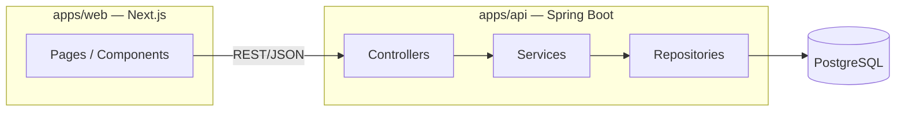
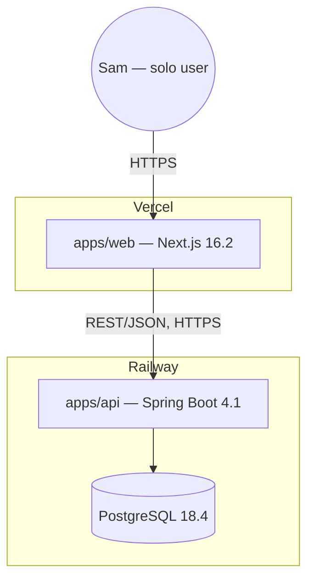
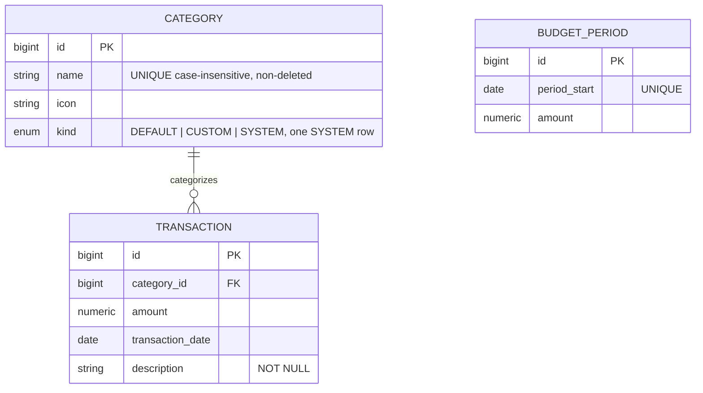

# Architecture Spine — bmad-expense-tracker

## Design Paradigm

**Layered monolith**, two deployables, one shared data owner:

- **`apps/web`** (Next.js) — presentation only. Renders UI, calls the backend over REST/JSON, never touches PostgreSQL directly, never computes a total.
- **`apps/api`** (Spring Boot) — the entire domain. Internally layered **Controller → Service → Repository**, enforced even for trivial endpoints. The Service layer is the only place business rules (derived totals, budget-status thresholds, category-deletion reassignment) may live.
- **PostgreSQL** — owned exclusively by `apps/api`. No other component reads or writes it.



Dependency direction is one-way and non-negotiable: `web → api → db`. Nothing depends back up the chain.

## Invariants & Rules

### AD-1 — Derived totals are structural, not procedural [ADOPTED]

- **Binds:** FR-4, FR-5, FR-10, all of Dashboard & Budget Status, Search & Filter
- **Prevents:** a service silently caching a total/remaining/spent figure, which would let the number drift from the transaction log it's supposed to represent — including a filtered/searched subset's running total, which is exactly as easy to accidentally sum client-side as any other total
- **Rule:** No table or column stores a total, a remaining amount, or a spent amount, anywhere in the schema. Every category total, period total, budget-remaining figure, and Search & Filter running total is computed by a Service-layer query at read time. `GET /api/transactions` (filtered) returns `{results, total}` with `total` server-computed over the filtered set. The client never sums — it only renders what the Service returned.

### AD-2 — REST/JSON is the only cross-boundary contract [ADOPTED]

- **Binds:** all FRs
- **Prevents:** `apps/web` reaching into PostgreSQL directly (e.g. via a shared ORM client or a "just this once" direct query), which would create a second, uncoordinated writer to the domain
- **Rule:** `apps/web` talks to `apps/api` exclusively over `/api/*` REST/JSON. `apps/api` is the sole owner of the database connection.

### AD-3 — DTOs at the API boundary, always [ADOPTED]

- **Binds:** all controllers
- **Prevents:** a JPA entity leaking its persistence shape (lazy-load proxies, internal-only fields) into the wire contract, coupling frontend to backend schema changes
- **Rule:** Controllers accept and return DTOs only. Entity → DTO mapping happens in the Service layer. No `@Entity`-annotated class is ever serialized directly in a response.

### AD-4 — Controller → Service → Repository, even for one-liners [ADOPTED]

- **Binds:** all of `apps/api`
- **Prevents:** a controller calling a repository directly "because it's simple," which fragments where business rules live and makes AD-1 unenforceable in the long run
- **Rule:** Every endpoint's controller delegates to a Service; only a Service may call a Repository.

### AD-5 — Category has three kinds, one deletion path

- **Binds:** FR-7, FR-8, FR-9, Transaction.category assignment
- **Prevents:** two different builders (Category Management vs. Transaction/reassignment logic) disagreeing on whether "Uncategorized" is a real row or a `NULL` sentinel, which would fork the reassignment code into two special cases; and a future FR-9 rename/re-icon endpoint silently accepting a request against the SYSTEM row because "never shown in the UI" was enforced only client-side
- **Rule:** `categories.kind` is one of `DEFAULT` (the 5 seeded categories — renameable/re-iconable, no delete affordance in the UI at all), `CUSTOM` (user-created — fully editable and deletable), or `SYSTEM` (exactly one row: Uncategorized). `CategoryService` — not the UI — rejects any create/rename/re-icon/delete request targeting `kind=SYSTEM`; a partial unique index (`WHERE kind='SYSTEM'`) guarantees exactly one such row, seeded once at startup via an idempotent check, never created on demand. Category `name` is unique (case-insensitive) among non-deleted categories, enforced at the DB (`UNIQUE`) and the DTO (validation) — the source of FR-7/FR-9's duplicate-name rejection. Deleting a `CUSTOM` category is a single FK reassignment of its transactions to the `SYSTEM` row — never a nullable `category_id`, never a second code path.

### AD-6 — Budget is a per-Period row, and it copies forward

- **Binds:** FR-6, FR-4, Dashboard
- **Prevents:** two builders disagreeing on whether a new month starts with "no budget" or last month's figure; two endpoints independently racing to create the same Period's row; and disagreeing on whether "no prior budget" produces an absent row or a zero-amount row
- **Rule:** `budgets` has one row per Period (`period_start DATE UNIQUE, amount NUMERIC(12,2)`), never a single mutable value. Row creation happens through exactly one idempotent Service method — `BudgetService.getOrCreateCurrentPeriodBudget()` — called by every endpoint that needs the current Period's budget (Dashboard status, Budget Settings); no endpoint inlines its own creation logic. If no prior Period has a budget row, **no row is created** and the endpoint returns "no budget set" (FR-6's neutral prompt); only when a prior Period's row exists does the method copy its amount into a newly-created row for the current Period — a copy, not a live reference, so editing the current Period's budget never mutates history. The `period_start` UNIQUE constraint plus an upsert (`INSERT … ON CONFLICT DO NOTHING`) makes concurrent first-touch requests safe. Spend is *always* computed fresh per Period (AD-1) regardless of this copy.
- **Note:** this resolves an ambiguity the PRD left open (whether "no rollover" governs spend only or the budget figure too — see memlog); it does not reintroduce Rollover (§8.2), since spend still starts at ₹0 every Period. Worth confirming back against the PRD/UJ-4 since it changes what a second-month Dashboard shows on first load.

### AD-7 — Money and dates never touch floating point or client-side math

- **Binds:** all FRs touching an amount or a date
- **Prevents:** rounding drift in budget-status thresholds, and a client-computed total silently diverging from the server's
- **Rule:** All amounts are `NUMERIC(12,2)` in PostgreSQL and `BigDecimal` in Java end to end — never `float`/`double`. All dates are ISO-8601. The client renders amounts and totals the server returned; it never sums or derives a status client-side.

### AD-8 — Errors are a single consistent shape

- **Binds:** all controllers
- **Prevents:** each endpoint inventing its own error JSON, which would force the frontend to special-case error handling per-call
- **Rule:** All failures flow through one `@ControllerAdvice`, configured before the first endpoint ships, returning `{ "error": { "code": "...", "message": "..." } }`. No controller catches and reshapes its own exceptions.

### AD-9 — Asia/Kolkata is the single clock authority

- **Binds:** FR-3, FR-4, AD-1, AD-6 — anything computing "today" or a Period boundary
- **Prevents:** the server (JVM default zone, likely UTC on Railway) and the client (browser-local clock) disagreeing on "today" near local midnight — which would file a chip-logged transaction into the wrong Period, or make the Dashboard's "current Period" disagree with the backend's for up to several hours
- **Rule:** All "today"/Period-boundary computation happens server-side, fixed to `Asia/Kolkata` (IST, UTC+5:30) — the product is INR/India-only with no multi-region need. The client never computes a date boundary; it only sends a user-picked date (backdating, FR-2) or omits the date (today, FR-1) and lets the server stamp it.

### AD-10 — Transactions are immutable once saved

- **Binds:** FR-2, FR-3, all of Quick Add
- **Prevents:** a future story adding an update/delete path for transactions — explicitly excluded from MVP by the PRD Glossary, and quietly assumed by AD-1: a derived total is only trustworthy if the ledger it sums isn't retroactively rewritten
- **Rule:** `TransactionController` exposes only `POST /api/transactions` (create) and `GET /api/transactions` (read/filter, FR-10). No update or delete endpoint exists for transactions in MVP scope.

## Consistency Conventions

| Concern | Convention |
| --- | --- |
| Naming (entities, files, interfaces) | Entities: `Transaction`, `Category`, `Budget`. Tables: snake_case plural (`transactions`, `categories`, `budgets`). REST resources: plural nouns under `/api/*` (`/api/transactions`, `/api/categories`, `/api/budget`) — no `/v1` prefix yet (YAGNI at solo-MVP scale; add a version segment only if a breaking contract change is ever needed). |
| IDs | Auto-increment `BIGINT` primary keys everywhere. No UUIDs — single-instance app, no distributed-generation need. |
| Data & formats | Amounts: `NUMERIC(12,2)` / `BigDecimal`, ₹ INR only. Dates: ISO-8601 (`yyyy-MM-dd`), always resolved server-side in `Asia/Kolkata` (AD-9). Errors: `{error:{code,message}}` via `@ControllerAdvice` (AD-8). |
| Validation | `Transaction.description`: `NOT NULL` at the DB and `@NotBlank` at the DTO — deliberately overrides earlier "optional description" research; required specifically to support FR-10 keyword search (see AD-10 for immutability). `Category.name`: unique case-insensitive among non-deleted categories (AD-5). |
| State & mutation | Only a Service method may mutate state; only a Service method may compute a derived total (AD-1, AD-4). No caching layer sits in front of a total. |
| Status/error copy | Factual, non-judgmental at every severity level — FR-4's hard requirement, not a style preference. Generated server-side in the Service layer (e.g. `"Budget exceeded by ₹250"`), never client-templated blame language. Full tone rules: `DESIGN.md` / `EXPERIENCE.md`. |
| Auth | None in v1 — single implicit user. If ever added, stateless JWT is the named future direction (not designed further here — see Deferred). |
| CORS | Configured on `apps/api` before the first `apps/web` call ships — not bolted on after integration breaks. |
| Observability | Spring Boot Actuator's `/actuator/health` enabled from day one (Railway's healthcheck depends on it). Structured JSON logs to stdout, captured by Railway's log viewer — no external log aggregator/APM for MVP (see Deferred). |
| Testing | Backend: `@WebMvcTest` per endpoint (status → content-type → payload) plus direct unit tests on the derived-totals and budget-status calculation specifically — the one piece of logic that must never silently drift. Frontend: component tests (Vitest/Testing Library) on Quick Add and Budget Status. No e2e for MVP. |
| CI/CD | GitHub Actions runs backend + frontend tests/lint on every push/PR; a red run blocks merge. Deploys happen via each platform's native git integration (Vercel for `apps/web`, Railway for `apps/api` + Postgres) after merge, not as a separate manual step. |

## Stack

| Name | Version |
| --- | --- |
| Next.js | 16.2 LTS (16.2.10) |
| Tailwind CSS | latest (shadcn/ui default) |
| shadcn/ui | latest, "Calm Harbor" brand-layer delta per `DESIGN.md` |
| Java | 25 LTS |
| Spring Boot | 4.1.0 (Spring Framework 7) |
| PostgreSQL | 18.4 |
| Frontend hosting | Vercel (Hobby/free tier — non-commercial ToS; 100GB bandwidth, no inactivity deletion) |
| Backend + DB hosting | Railway (Hobby plan — $5/mo is a usage credit, not a cap; running Spring Boot + Postgres 24/7 realistically costs ~$10–30/mo metered) |
| CI | GitHub Actions |

## Structural Seed

### Container view



### Deployment & environments

Two environments only: `dev` (local — `docker-compose` running Postgres; `apps/web` and `apps/api` run natively via `next dev` / Spring Boot dev mode) and `prod` (Vercel + Railway, as above). No staging environment at solo-MVP scale — GitHub Actions' CI gate (test/lint on every PR) is the quality gate in place of one. Both platforms deploy from `main` on merge, each configured to build from its own subfolder of the monorepo.

### Core entity ERD



`BUDGET_PERIOD` has no FK to `TRANSACTION` — a Period's spend (AD-1) is derived by filtering `TRANSACTION.transaction_date` into the period's date range at read time, never joined and cached. It also has no FK to itself: the copy-forward described in AD-6 is a one-time value copy performed by `BudgetService.getOrCreateCurrentPeriodBudget()`, not a stored relationship.

### Source tree

```text
bmad-expense-tracker/
  apps/
    web/                    # Next.js 16.2 app — deploys to Vercel
      app/                  # App Router pages: dashboard, quick-add, budget, categories, search, settings
      components/           # shadcn/ui-based components (budget-status-card, category-icon-button, ...)
      lib/                  # API client (REST/JSON only — no DB access)
    api/                    # Spring Boot 4.1 app — deploys to Railway
      src/main/java/.../controller/   # REST controllers, DTOs in/out only (AD-3)
      src/main/java/.../service/      # business rules, derived totals (AD-1), budget copy-forward (AD-6)
      src/main/java/.../repository/   # Spring Data JPA repositories
      src/main/java/.../entity/       # JPA entities (never returned directly — AD-3)
      src/main/java/.../dto/
      src/main/java/.../config/       # CORS, @ControllerAdvice (AD-8)
  .github/workflows/        # CI gate: backend + frontend test/lint on every push/PR
  docker-compose.yml        # local Postgres 18.4 for dev
```

## Capability → Architecture Map

| Capability / Area | Lives in | Governed by |
| --- | --- | --- |
| FR-1 Frequent-expense chip logging | `apps/web` Quick Add + `apps/api` `TransactionService` | AD-1, AD-2, AD-7 |
| FR-2 Manual transaction entry | `apps/web` Quick Add + `apps/api` `TransactionController`/`Service` | AD-2, AD-3, AD-4, AD-7 |
| FR-3 Transaction-date period assignment | `apps/api` `TransactionService` (period computed from `transaction_date`, not entry time) | AD-1, AD-6 |
| FR-4 Live budget status | `apps/web` Dashboard + `apps/api` `BudgetService` (status thresholds: green <80%, amber 80–100%, red >100%) | AD-1, AD-6, AD-7 |
| FR-5 Derived totals | `apps/api` `TransactionService`/`BudgetService` query layer | AD-1 |
| FR-6 Set and edit budget | `apps/web` Budget Settings + `apps/api` `BudgetController`/`Service` | AD-6, AD-7 |
| FR-7/FR-8/FR-9 Category CRUD | `apps/web` Categories + `apps/api` `CategoryController`/`Service` | AD-5 |
| FR-10 Filter transactions | `apps/web` Search & Filter + `apps/api` `TransactionController` (query params: date range, category, keyword; response `{results, total}`) | AD-1, AD-2, AD-10 |
| Last-used category default (Quick Add) | `apps/api` `TransactionService` (derived from the most recent transaction's category — server-derived, not client-cached, per the backend-persisted-only stance) | AD-2 |

## Deferred

- **Auth/accounts** — no v1 design. If added, stateless JWT is the named direction (PRD addendum); revisit when a real multi-user need appears.
- **Frequent-Expenses Shelf ordering/cap mechanism** — the ranking *algorithm* (top-N by frequency, trailing window, tie-breaks) is left as an implementation detail per the PRD (§10), resolved during `TransactionService` build without a schema change. What's fixed now, not deferred: it is computed server-side by a dedicated endpoint (e.g. `GET /api/transactions/frequent`), never derived client-side from the raw transaction list — consistent with AD-1's client-never-computes principle.
- **Category icon set** — specific icon values unnamed upstream; resolve during `apps/web` Categories build.
- **Rollover of spend across periods** — explicitly out of scope for MVP (confirmed exclusion, not a cut); AD-6's per-period budget row already makes this the default (each period's spend is independently derived), so no future schema change is needed to keep it excluded — only a future Service-layer rule would be needed to ever introduce it.
- **External error-tracking/APM** (e.g. Sentry) — not wired for MVP; stdout logs + Railway's dashboard are sufficient at solo-user scale. Revisit if silent failures become hard to diagnose.
- **Staging environment / blue-green deploys** — not warranted at solo-MVP scale; the CI gate substitutes for now. Revisit if usage or collaborator count grows.
- **API versioning (`/v1`)** — not introduced until a breaking contract change is actually needed.
