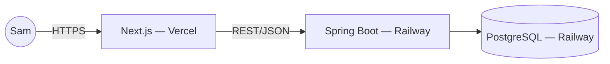

# Solution Design: bmad-expense-tracker

This is the human-readable explanation of *why* the architecture looks the way it does. `ARCHITECTURE-SPINE.md` in this same folder is the canonical build contract — every rule here traces back to an `AD-n` there. Read this first for the reasoning; read the spine when you're implementing and need the enforceable rule.

## What we're building

A personal expense tracker, solo-built, meant for long-term real use rather than a portfolio piece that gets abandoned after review. The one non-negotiable rule underneath everything: category totals, period totals, and budget status are never stored — they're always computed live from the transaction log. That single decision shapes most of what follows.

## Shape: a layered monolith, split across two hosts

**Monolith, not microservices** — this was settled by earlier technical research and re-confirmed here: one backend service is faster to build, easier to reason about, and easier to test for a solo build validating a product idea, without being a one-way door if it ever needs to split later.

**Split hosting, not one host** — Next.js goes to Vercel (its native home, free, zero-config); Spring Boot and PostgreSQL go together to Railway (a real paid tier with persistent volumes). We ruled out Render's free tier specifically because its free Postgres expires after 30 days, which directly violates the product's own requirement that data must persist indefinitely for real personal use. Railway's advertised "$5/mo" is a usage-credit floor, not a hard cap — the real cost range is in the Stack table below, worth knowing going in rather than discovering on a bill.

**A GitHub Actions CI gate from day one** — tests and lint must pass before anything merges, even though it's a one-person project. The extra setup cost now buys portfolio credibility and catches regressions earlier than a "deploy and see" approach would.

## The invariant that drives the data model

Nowhere in the schema does a "total," "remaining," or "spent" column exist. Every number the Dashboard shows is a live query over the `transactions` table at read time. This isn't just a nice property — it's enforced structurally: if the column doesn't exist, a future service can't accidentally cache a stale total. The same discipline extends to the client: the frontend never sums rows itself, including the running total on the Search & Filter screen — it only ever displays a number the backend already computed.

## Two data-model decisions worth explaining

**Categories have three kinds, not two.** Most of the product treats categories as either the 5 built-in defaults (renameable, never deletable) or custom ones a user adds (fully editable and deletable). But "Uncategorized" — where a deleted category's old transactions land — needed a third bucket. Rather than modeling it as a `NULL` category reference (which would force every query in the codebase to special-case "no category"), it's a real, seeded category row that the system protects from being edited or deleted, enforced in the service layer itself, not just hidden from the UI.

**Budgets are per-period, and they copy forward.** The PRD was explicit that spend resets to zero every month (no rollover) but silent on whether the *budget number itself* has to be re-entered every month. We resolved that in favor of low friction: a new month automatically starts with last month's budget figure (still fully editable), while spend starts fresh at zero. Practically, this means the "set your first budget" prompt only ever appears once — after that, the Dashboard always has a number to show. (This is a real product-behavior choice, not just plumbing — flagged back into the PRD addendum so the two documents don't quietly disagree.)

## The timezone risk this design closes off

India-only product, IST users — but a server can default to UTC without anyone deciding that on purpose. If "today" were computed differently by the browser and the backend, a transaction logged right around midnight could file into the wrong month on one side and the right month on the other, and nobody would notice until a Dashboard total looked wrong. The fix is unglamorous but total: the server is the only clock that matters, fixed to `Asia/Kolkata`, always. The client never computes a date boundary — it either sends a picked date or says nothing and lets the server stamp "today."

## What's deliberately not designed yet

- **Auth** — no accounts in v1 at all; if that ever changes, stateless JWT is the named direction, not evaluated further now.
- **The frequent-expense chip ranking algorithm** — *that* it's computed server-side is fixed; *how* it ranks (frequency window, tie-breaks, cap) is left for implementation.
- **Monitoring beyond the basics** — a health-check endpoint and stdout logs are wired from day one; a real error-tracking tool (e.g. Sentry) is deferred until debugging blind actually becomes painful.
- **A staging environment** — the CI gate is the quality gate for now; add staging only if usage or collaborators grow enough to need it.

## Stack, pinned

| Layer | Choice | Version |
| --- | --- | --- |
| Frontend | Next.js + Tailwind + shadcn/ui | Next.js 16.2 LTS |
| Backend | Spring Boot | 4.1.0 (Spring Framework 7) |
| Runtime | Java | 25 LTS |
| Database | PostgreSQL | 18.4 |
| Frontend hosting | Vercel | Hobby/free tier |
| Backend + DB hosting | Railway | Hobby plan (~$10–30/mo realistic) |
| CI | GitHub Actions | — |

All versions verified current as of 2026-07-03 — see `.memlog.md` for the research trail.

---

*For the enforceable rules (the `AD-n` blocks), the entity diagram, the source tree, and the full capability map, see `ARCHITECTURE-SPINE.md` in this folder.*
